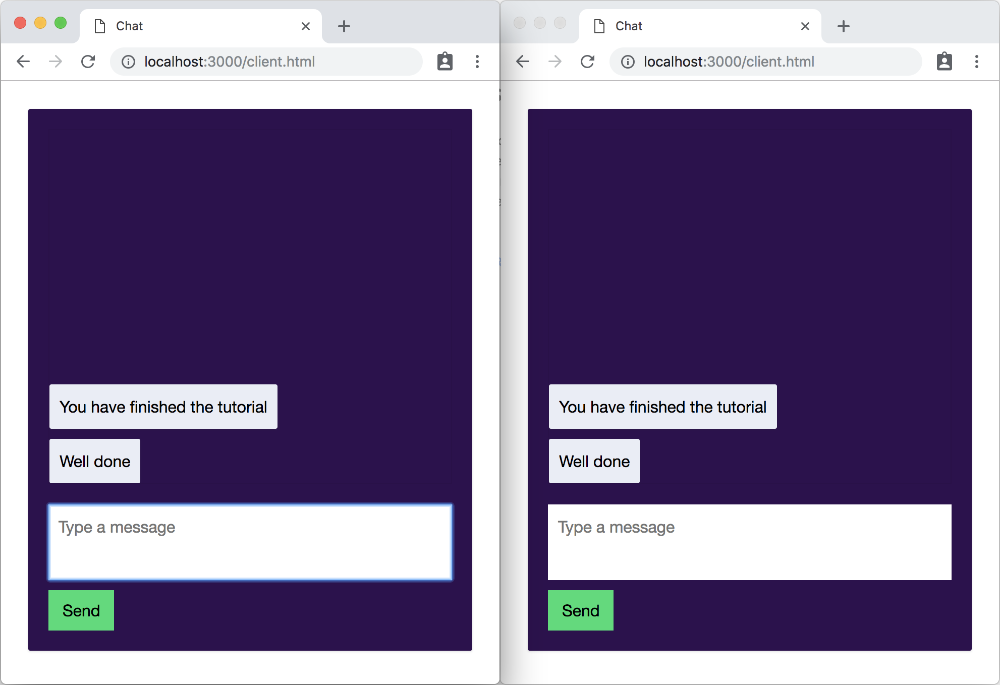

# Channels Curriculum task
To get you familiar with the basics of using Pusher Channels, we are going to start by building a very basic chat application. [Pusher Chatkit](https://pusher.com/chatkit) provides many essential chat features out of the box. However some customers opt to build their own chat using Channels. That is what we are going to do. If you get stuck you can look at the finished code in the `finished` directory. You can also contact @tomkemp on Slack. This tutorial assumes you are using a Mac. The steps will be different on other operating systems so ask if you get stuck.

Our simple chat app is going to let users send messages which will be visible to anyone else with the chat window open. A basic version of the app has already been created, but it isn't realtime. Currently, users must refresh the page before they see messages posted by other users. We are going to fix this, by utilising Pusher Channels to make the chat realtime.


## Step 1: Download the prebuilt code from Github
Software developers manage their code using [version control](https://en.wikipedia.org/wiki/Version_control) and git is one such system. The code for this tutorial is stored on GitHub. The first step is to make sure you have git installed and then download the existing code from GitHub. 

Open the spotlight search box, type “Terminal” and select the “Terminal” application.


In the terminal window that opens, type: 
```bash
git
```
and press enter.

If you don't currently have git installed then you should be promted to install `Command Line Developer Tools`. If git is installed then the git help page will be displayed, listing the possible git command:


If you need to install git then use the installer that opens:


Once the installation is finished, type: 
```bash
git
```
This time, you should see the help page. Next, we will use git to download the existing code from GitHub. In the terminal, type:

```bash
cd ~/Desktop
```
and press enter. This changes your current directory to the Desktop. 


Now type: 

```bash
git clone https://github.com/pusher/channels-curriculum-task.git
```

and press enter. This will download the project files to a directory on your desktop, called `channels-curriculum-task`.

## Step 2: Install your IDE
Next, we are going to install an integrated development environment (IDE). This is a text editor with special features, such as syntax highlighting, that make it easier to write code. The IDE we are going to use is Visual Studio Code.

Download it from this URL: https://code.visualstudio.com/Download 

Once the download has completed, unzip the file and move the Visual Studio Code app to you applications directory. 


Open Visual Studio Code. We now want to add the code that we downloaded from GitHub so we can run and modify it. To do this, click `File` then `Add folder to workspace`, and navigate to the `channels-curriculum-task` on your Desktop. Open that directory and click Add. The `channels-curriculum-task` directory will now be visible in the Explorer on the left side of the window.

The IDE has many features. If you are interested, there is a detailed "getting started" guide on the Visual Studio Code website [here](https://code.visualstudio.com/docs/getstarted/userinterface), but for our purposes we only need to know about 3 parts.


 - Explorer - Explore the files that make up the application
 - Editor - This is where the files are displayed for you to edit. Click on server.js in the explorer window and you will see the contents of the file in the editor.
 - Terminal window - a terminal instance that can run commands, such as starting the server. You can open this by left clicking on a file in the Explorer (e.g. `server.js`), and selecting `Open in terminal`.

## Step 3: Install node.js
The chat app is comprised of a client, which is a webpage displayed in a browser, and a server. The server is written in Node.js, which is JavaScript. 

You might already have Node.js installed. To test this, right click on server.js in Visual Studio Code, and click “Open in terminal”. In the terminal window that opens, we are going to run a command. Type:
 ```bash
 node --version
 ```
 and press the enter/return key. If the response is a version number (e.g. something similar to: v8.9.4) then you have Node.js installed and you can skip to step 4. If not, we need to install it.

You can download Node.js [here](https://nodejs.org/en/download/). You should download the LTS version, macOS Installer (.pkg), 64 bit.

When the download is finished, run the installer and follow the instructions. 

After the installation is complete, we will verify that the installation was successful. Go back to Visual Studio Code and right click on server.js again and click “Open in terminal”. (Do it again even if you already have the terminal open). Now run the command a second time:
 ```bash
 node --version
 ```
This time, you should see a version number.

## Step 4: Run the application and explore it
When building an application, there’s no need to create everything from scratch. We make use of code written by others in the form of libraries. The libraries that a project imports are known as the project’s dependencies. Before we can run the application, we need to install its dependencies. To do that, simply run the command:
```bash
npm install
```
This will install all of the dependencies listed in the “package.json” file. 

Once all the dependencies are installed, we are ready to run the application. To do that, simply type:

```bash
npm start
```
You should see the following output:


You can now visit the app in the browser: [http://localhost:3000/client.html](http://localhost:3000/client.html). Try typing a message and clicking “Send”. You will notice that the message appears in the browser. To stop the server, click the terminal window in Visual Studio Code so it has the focus, then press Control + C on your keyboard.

It will be useful for you to have the chat open in two browser windows for the rest of this tutorial so you can see how your changes affect what different users see. Remember, our goal is to update the app so that if a user sends a message, all other users receive it in realtime. Currently, other users have to refresh the webpage before they see a new message. Try that out.


## Step 5: Familiarise yourself with the code
JavaScript is a programming language originally designed for use in browsers but it can also run on servers too (Node.js). This tutorial won't teach you to code but don't worry if you are new to coding: this tutorial will provide code snippets that you can copy and paste. [This webpage](https://developer.mozilla.org/en-US/docs/Learn/Getting_started_with_the_web/JavaScript_basics) provides an overview of programming in JavaScript which may be useful if you are new to it.

The application is made up of a number of files, with different purposes. We’ll explore some of them now.

 - static/client.html - This file is transmitted by the server to the user’s browser and is run in the browser. It contains HTML and Javascript. HTML is a language that defines how web pages are structured, and Javascript is a programming language used to manipulate that HTML.

 - server.js - This is the server that handles requests from the client and delivers the response to the user’s web browser. Currently, it receives new messages posted by users and stores them in the database. When a user first opens the webpage, the webpage makes a request to the server for all the existing messages. To do this, the server exposes to endpoints “getMessages” and “newMessage”. 


You will see there are comments throughout the client and server which in JavaScript, start with `//`. Comments explain the code and have no bearing on the execution of the code. They are ignored. They are used to make the code more understandable to humans. In HTML, comments look like this:


## Step 6: Decide how we will utilize Pusher Channels
You have seen that when a user types a new message, it only appears on their own screen: it isn’t sent to anyone else with the chat open. Other users have to refresh the page before they see the new chat messages. Pusher Channels is perfect for distributing messages in realtime to many interested clients. We will add Pusher Channels to this app to make it realtime.

We will create a single channel for this app called “chat-app”. The client will create a subscription to this channel when the page opens. Whenever the server receives a new message, it will trigger an event on that channel which will be sent to all the connected clients. The clients can then update their page with the new message. That will mean that users will receive the new messages automatically without having to refresh the page.


## Step 7: Create a Channels account and create an app
First, we need to set up a Channels account and create a Channels app to use in this tutorial. Navigate to [dashboard.pusher.com](https://dashboard.pusher.com). If you already have a Pusher account then you can log in. If not, create one. Once you have created an account, create a new app. The name or cluster isn’t important.


## Step 8: Add Pusher Channels to the client
Next, we will add the Pusher client libray to the webpage. This will subscribe to our “chat-app” channel and receive any new messages published by the server. We can then display the new message on the page. Remember, the finished code can be found in the `finished` directory so you can check that if you get stuck. After any changes you make in this section, make sure to save the document and refresh the webpage in the browser.

Open `client.html`, located in the `static` directory.

Add the following line under the `<!-- Script imports -->` comment, around line 10.
```html
 <script src="https://js.pusher.com/4.3/pusher.min.js"></script>
```
This imports the Pusher Channels Javascript library, pusher-js.

Next, add the following code below the comment that says ”Add Pusher connection code here” (around line 15). This creates a new instance of the library and opens a websocket connection to Pusher. You should replace the `xxxxx` values with your app key and cluster, which you can find on the dashboard. 
```js
var pusher = new Pusher('xxxxx', {
    cluster: 'xxxxx',
    forceTLS: true
});
```

Next we need to subscribe to the channel. Add the following line below the comment that says ”Add Pusher subscribe and bind code here” (around line 20)

```js
var channel = pusher.subscribe('chat-app');
```
This subscribes the client to the `chat-app` channel, so any messages triggered on that channel will be sent to us.

Finally, we need to bind callbacks to the “new-message” event. This means we define a piece of code that should be executed when the “new-message” is received. When a new message is recieved, we want to add it to the page. We can make use of the “addMessageToPage” function that already exists in the app. Add the following code snippet just below the previous snippet: 

```js
channel.bind('new-message', function(data) {
    addMessageToPage(data.message);
});
```

This extracts the message payload and passes it to the addMessageToPage function. You can save and refresh the page. The code we added recieves messages triggered on the channel, but we haven't yet modified the server to trigger messages when sent by a client. Therefore you shouldn't yet see any change in behaviour when sending messages.

To test the code we just added, we can use the debug console on the Channels dashboard. The debug console is useful when developing apps. It outputs any messages sent via the app, as well as a number of other events such as new connections being established, or webhooks being sent. We can also use the debug console to trigger test events. Navigate to the debug console now. It can be found by navigating to the page for your app, and clicking the "Debug Console" tab.


Click `Show event creator`. Set the channel field to `chat-app` and the event to `new-message`. Now add the following body:

```json
{
    "message": "Sent from debug console"
}
```

 When you click `Send event` the event will be sent. This is received by all the current subscribed clients, who will then add the message to the page. Try that now. You can try changing the message text to something else. Make sure you have refreshed the page in the browser after making your previous changes before triggering the message

Notice that the messages sent via the debug console disappear when the page is refreshed. This is because they aren’t sent to our server so aren’t stored. We now need to add Pusher code to our server.

## Step 9: Add Pusher Channels to the server
Open `server.js`.

Whenever a new message is posted, a request is made to the `/newMessage` function. The server then stores the post in the database so that we can load the messages when the page first loads. When a new message is received, we want to transmit it using Pusher to anyone who has the page open. After any changes you make in this section, make sure to save the document.

First, we need to import the Pusher library. Add the following line to the top of server.js, in the section that imports libraries (roughly line 8).

```js
const Pusher = require('pusher');
```

Next, we need to create an instance of the Pusher object. Add the following line below the comment that says `// Add Channels connection code here` (near line 19). Replace the appID, key, secret, and cluster with your apps details. You can find these on the dashboard.

```js
const pusher = new Pusher({
    appId: 'xxxxx',
    key: 'xxxxx',
    secret: 'xxxxx',
    cluster: 'xxxxx',
    encrypted: true
});
```

Next, we need to add code to the `/newMessage` handler to trigger the `new-message` event on the Pusher channel whenever the server recieves a new message. Add the following code snippet to the `/newMessage` handler, just below the comment that says `// Add Channels trigger here` (near line 36).

```js
pusher.trigger('chat-app', 'new-message', { message });
```

Now fresh all of the browser windows and you should see that whenever a message is sent, all instances of the client receive the message in realtime, without having to refresh the page.

However, you might notice there is a problem. The message gets sent to the sender as well as all the recipients meaning that the message is displayed twice on the sender’s page. To solve this, Channels allows you to exclude a recipient when triggering a message. In order to do this, we need to submit an identifier for the connection to the server, so it knows which client to exclude from recieving the message.

Open client.html and locate the `sendMessage` function (near line 59). Modify the `body` field of the `fetch` section so it goes from looking like this:
```js
body: JSON.stringify({
    messageText
})
```
to this:
```js 
body: JSON.stringify({
    messageText,
    socketId: pusher.connection.socket_id
})
```
You should just need to add an extra comma after `messageText` and then add the line: `socketId: pusher.connection.socket_id` below that. That will send the server the `socket_id` of the client which uniquely identifies it.

Next we have to modify the server code that triggers the message. The server will recieve that socket_id and then pass it to Pusher, so that Pusher knows not to deliver the message to that client. Open `server.js` and find the `newMessage` handler, near line 31. Find the line that looks like this:

```js
let message = request.body.messageText;
```
and add the following line below it:
```js
let socketId = request.body.socketId;
```
That line receives the socketId from the client. We now need to send that socket id to Pusher whenever we trigger a message in order to exclude that client. Modify the trigger line from this:
```js
pusher.trigger('chat-app', 'new-message', { message });
```
to this:
```js
pusher.trigger('chat-app', 'new-message', { message }, socketId);
```
Now refresh the browser windows. Each message should now only display once for each user, including the sender.

## Step 10: Try it out
Refresh all the browser windows and try it out. Now, whenever the server receives a new message, it triggers an event on the “chat-app” channel. Pusher Channels delivers that event to any client currently subscribed. When the client receives the new message, we add it to the web page. Now, everyone is notified of new messages. We have used Pusher Channels to make this chat app realtime.



Well done, you’ve completed the tutorial and sent your first messages with Pusher Channels!
